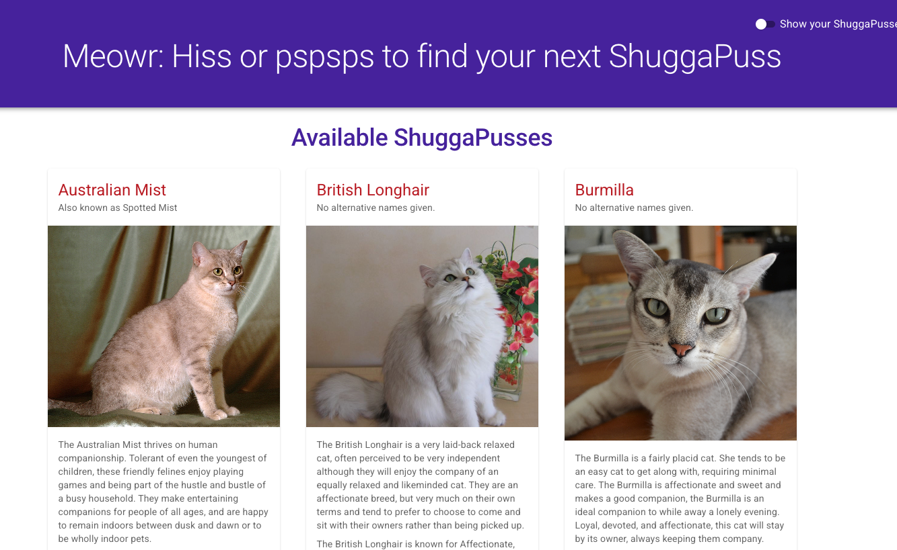
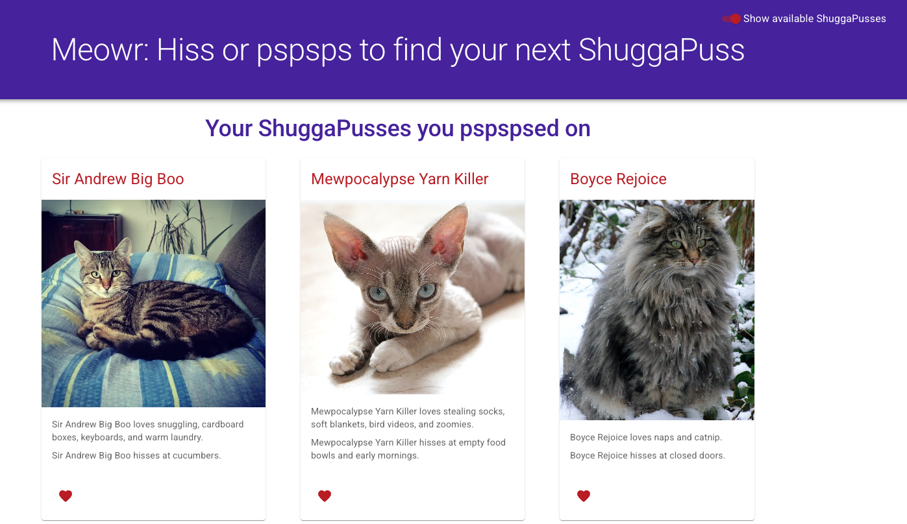

# Meowr: Hiss or pspsps to find your next ShuggaPuss

## What

Meowr is a mock dating app for people to find their next ShuggaPuss. It loads 15 cats from The Cat API and allows people to favourite them. They can see what cats they've favourited when the toggle the view. 

## Where

[Meowr Shuggapuss](http://www.ihatetoast.com/meowr-shuggapuss/)

## Why

Why TF not‽ I want to play with a free API. I also wanted to get familiar with Material UI's React components. What else? Oh, yes. I wanted to practice with local storage. No. This is absolutely a lie. I had no desire to do that, but when I saw that the favourite request returns just the image, I was bored. I wanted to create names, likes, and dislikes. Unfortunately, every change in favouriting refreshed their names. Amusing to me because I enjoyed my little creation, but I wanted the names to persist. I had a few options: go back to just images or gird my dev loins and tackle local storage. Well, slap my utils and call me Shirley, I opted for the latter. 

## How
- The API:  [The Cat API ](https://thecatapi.com/)
- The UI tools: [MUI Material UI's React suite of components](https://mui.com/)
- The build tools: [Vite with React template](https://vite.dev/)

Cat feed:

Favourites:

[Meowr](https://www.ihatetoast.com/meowr-shuggapuss/)
